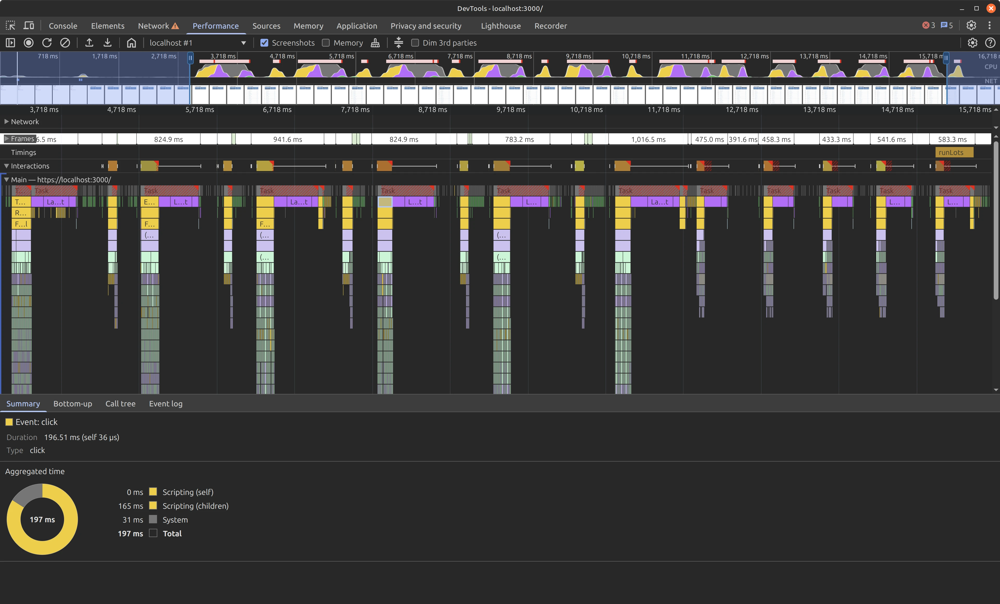

One of the major innovation that JavaScript frameworks have made over the past decade is the idea of removing the overhead of a framework and ship vanilla JavaScript using a compiler, an idea pioneered by Rich Harris, the creator of [Svelte](https://svelte.dev/) in his blog post ["A Framework without the framework"](https://svelte.dev/blog/frameworks-without-the-framework) and explored further by Evan You, the creator of [Vue.js](https://vuejs.org/) and [Vite](https://vite.dev/) in his talk [Compile-time Optimizations in JavaScript Applications](https://www.youtube.com/watch?v=7iy8XQ7TSnc)

Having a compiler transform framwork specific language like Svelte back to vanilla JavaScript was a game changer, it made bundle size of web apps extremely small, comparably if you were to write it in vanilla JS and performance is incredibly fast thanks in part by the compiler analysis of where to trigger dirty checking, removing the overhead of the "virtual DOM" in the case of Svelte 3. In Vue 3's case, it fuses the intellegence of a compiler to its virtual DOM to achieve a ["compiler‑informed Virtual DOM"](https://vuejs.org/guide/extras/rendering-mechanism?utm_source=chatgpt.com#compiler-informed-virtual-dom).

But both innovation introduced a new step in the deployment process of web applications by requiring an app to be compiled first back to vanilla JS before it is ship to production.

Wouldn't it be nice if we could ship performant web apps with relatively small bundle size and without a compilation step?

# Introducing Core

[Core](https://github.com/icevelez/core.js) is a new component-based framework that fills in the shoes of frameworks from the 2010-2016s with the insight gain by frameworks of today. It has a component authoring experience similar to Angular using a Handlebar syntax like Svelte for templating, with reactivite primitives of Signals popularized by [Solid](https://solidjs.com/).

It ships a Handlebar parser that parses a template once, converting it into DOM nodes (to be cloned upon rendering) then walk over those DOM nodes (recursively) looking for any dynamic binding, creating an instruction set on how to apply said binding then storing both the instruction set and DOM nodes separately for later use, and upon rendering, we clone the stored DOM nodes and apply the stored instruction set to to do little work as possible, only applying processes to nodes with dynamic bindings.

Applying similar optimizations as a compiler at runtime.

> "Is that enough?"

Yes? It performs relatively fast at creating and updating 10,000 rows, swapping rows, and deleting one row out of 10,000 using the `js-framework-benchmark` it's uncompressed bundle size is large ~64.1KB but gzipped compressed it goes down to ~13.6kB

> "How about minified + gzipped?"

I don't plan to minify the source code for `Core` mainly because I want the developer using Core to own the code such that they can modify it if they want to or when they need to. Using JSDoc to gain type safety and some small comments here and there to help guide the reader

# What I left out

Now this doesn't mean a compilation step is bad, in fact Rich Harris even says a [*"build steps are good"*](https://youtu.be/uXCipjbcQfM?si=3HHAccg4ZXnSyFR7&t=1842) to which I agree, listing the benefits of having a build step
- Minifying code leading to smaller bundle sizes
- Bundling multiple JavaScript module to a single file for network optimization. Only needing to request one file for an entire app
- Removing unused code
- Prevent bugs by type checking and linting

But personally I still want to move away from having a build step to having no build step. Since I started web development the first few apps that I built had no build step, they were pure JavaScript and I'd like to go back to that route even if it's only for my hobby projects.
