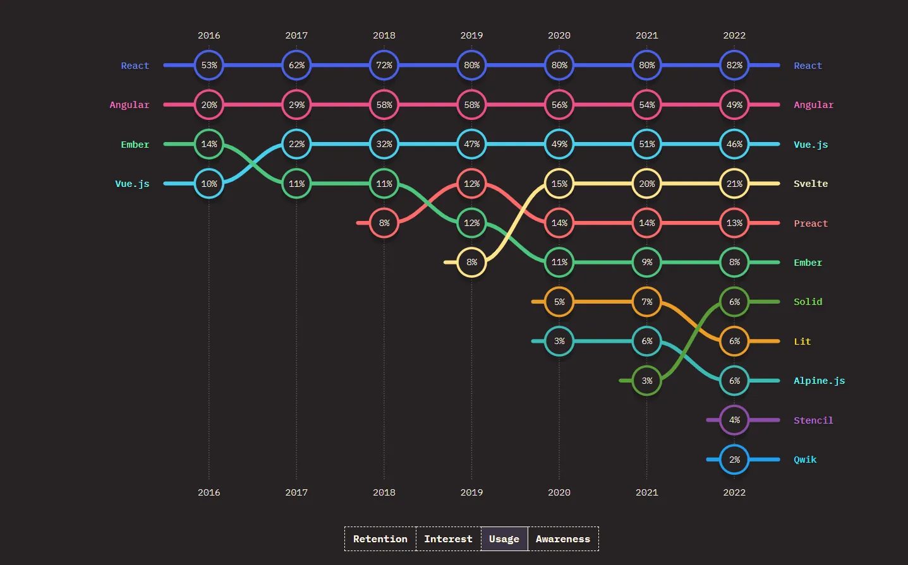

# What is Core.js?

Core.js is a front-end js framework that has no build-step. It uses [Handlebar](https://handlebarsjs.com/) and [Svelte](https://svelte.dev) inspired syntax for template expression interpolation and control flow statements; It has an Angular 2+ like component authoring experience and [Signals](https://dev.to/this-is-learning/react-vs-signals-10-years-later-3k71) as a means to keep track of state changes.

```js
import { load } from "../core/core.js";
import { component } from "../core/template-engine/handlebar.js";

export default component({
    template: await load("src/App.html")
}, class {
    constructor() {}
});
```

It's initialization is similar to a traditional framework using [Vite](https://vite.dev) project with a main.js as its bootstrap mechanism

```js
import { mount } from './core/core.js';
import App from './src/App.js';

mount(App, { target: document.getElementById('app') })
```

# Why did I make another front-end JS framework?

> tl:dr - I wanted to. To satify an itch in my brain so to speak

It boils down to two main factors why I made this framework
- Get away from a build step, just code inside the `/public` folder of my Go back-end and see the front-end straight away
- Have full control of every single piece in my software stack.

Now I understand there are many benefits of having a build step discussed by [Evan You in his 2017 talk at ReactiveConf](https://www.youtube.com/watch?v=7iy8XQ7TSnc) like removing the performance overhead in the browser by processing the template at compile-time (AOT) instead of run-time (JIT), hoisting static DOM element to be re-used when diffing the vdom, removing unused code via tree-shaking, and code optimization by partial evaluation.

I even went and ported over the [Svelte JS Bencmark source code](https://github.com/krausest/js-framework-benchmark/tree/master/frameworks/keyed/svelte/src) to Core.js and compared it against Svelte and Angular which Core.js performed slower than both (especially the "create 10k entries")

# Project Link

[Github](https://github.com/icevelez/core.js)
