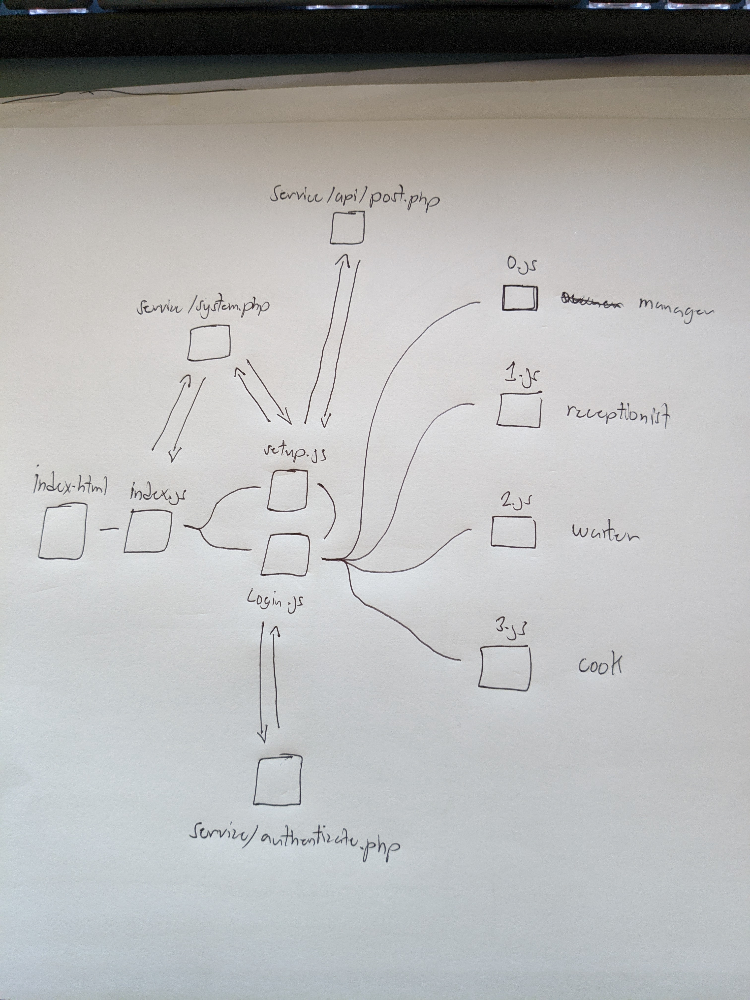

I didn’t come to this conclusion from nostalgia or minimalism.
I came to it by accident.

4 years ago, I built an internal government system using nothing but **HTML, CSS, and JavaScript**. No framework. No bundler. No build pipeline. Just files served to a browser.

At the time, I didn’t think I was making a philosophical statement about the web. I was just trying to get something working with the tools I understood.

Only later did I realize something surprising:

I had accidentally built a “modern” web app by relying almost entirely on what the browser could already do.

---

## Building Components Without a Framework

The app was component-based, but not in the way people expect.

I had a helper function:

```js
html.create(tag, attributes, children)
```

It created real DOM nodes. No virtual DOM. No compilation. Just:

* Create an element
* Set attributes
* Append children

And I nested it:

```js
html.create("div", { class: "card" }, [
  html.create("h1", {}, ["Dashboard"]),
  html.create("button", { onclick: refresh }, ["Reload"])
])
```

It looked a bit like JSX, but it was plain JavaScript generating real DOM. What you saw in DevTools was exactly what the browser executed. No hidden transform layer.

There were no reactive primitives. When state changed, I re-rendered explicitly. It wasn’t the most elegant system, but it was readable, debuggable, and understandable straight from “View Source.”

---

## I Didn’t Know the History — But I Benefited From It

I was using native `import` and `export` simply because splitting code into files felt natural. I had no idea this capability was the result of years of struggle with Asynchronous Module Definition (AMD), CommonJS, and bundlers trying to simulate a module system that didn’t yet exist.

I was standing on top of platform progress I didn’t even know had happened.

Here is a sketch that I made in 2022 unaware that this kind of project architecture splitting files by module was natively impossible 7 years ago


---

## The Feature I Wanted Already Existed

I remember wanting one specific improvement: I didn’t want the dashboard code to download until after login. The sign-in page didn’t need the whole application.

Today I’d write:

```js
const dashboard = await import('./dashboard.js')
```

But I didn’t know dynamic `import()` existed back then. So the entire app downloaded upfront.

The platform had already solved the problem. I just didn’t know it.

That moment stuck with me later, when I began learning more about bundlers, code splitting, and build tooling. It made me question how many “necessary” tools were still compensating for limitations that no longer existed.

---

## We Built Tools for a Web That No Longer Exists

Most heavy frontend tooling came from real constraints.

Browsers once lacked:

* A native module system
* Efficient request concurrency
* Modern CSS structuring tools
* Strong compression and caching

So we built solutions in userland.

We bundled files because HTTP/1.1 made multiple requests expensive.
We invented module formats because JavaScript had none.
We used CSS preprocessors because managing styles at scale was painful.

But the platform evolved.

| Old Problem                 | Tooling Solution                        | Modern Reality                                  |
| --------------------------- | --------------------------------------- | ----------------------------------------------- |
| Many HTTP requests are slow | Bundle everything                       | HTTP/2 & HTTP/3 multiplexing                    |
| No module system            | AMD / CommonJS / Bundlers               | Native ES Modules                               |
| No lazy loading             | Code splitting                          | `import()`                                      |
| CSS collisions & structure  | SASS, PostCSS, scoped CSS in frameworks | `@scope`, `@layer`, CSS variables, `:where()` |
| Large payloads              | Extreme minification                    | Brotli + better caching                         |

The web platform absorbed many of the responsibilities our build tools once handled.

---

## Bundlers Are Brilliant — But Are They Still Necessary?

Bundlers are engineering marvels. But it’s worth asking: are they still solving a fundamental limitation, or optimizing around outdated assumptions?

### Code Splitting vs Native Lazy Loading

Bundlers promote code splitting as a key performance feature. Under the hood, this often compiles to dynamic `import()` — which browsers already support natively.

Bundlers group modules into chunks to reduce request counts, which made sense when many small requests were slow. But HTTP/2 and HTTP/3 allow multiplexed requests over a single connection efficiently.

We are still optimizing for a network model that has largely changed.

### The Minification Trade-Off

Minification works best when the optimizer sees the whole program. Variable renaming and compression are more effective globally.

When we split into chunks, each file is minified in isolation. Cross-chunk compression opportunities shrink. Global renaming becomes impossible.

In other words, code splitting — done to improve loading — can reduce the theoretical efficiency of minification.

The loss isn’t catastrophic, but it’s ironic: we add build complexity for optimizations that counteract each other.

### Tree Shaking Isn’t a Silver Bullet

Tree shaking sounds like magic: unused code disappears.

In practice, it depends heavily on how developers write imports. For example:

```js
import * as Utils from './utils.js'
```

From a bundler’s perspective, any property on `Utils` might be accessed dynamically. Everything must stay.

Tree shaking works best in ideal scenarios like

```js
import { formatDate } from './utils.js'
```

Especially in large teams, where convenience often wins over theoretical optimization. Tools promise perfect dead code elimination, but JavaScript’s dynamic nature makes that guarantee fragile.

We built tools that assume perfect static structure, then fed them messy, human-written programs.

---

## CSS Is Catching Up

CSS has evolved in ways that reduce the need for heavy preprocessing:

* `@layer` helps organize style priority
* `@scope` limit the styles to a specific part of the DOM
* `:where()` and `:is()` help manage specificity
* Native variables replace many SASS use cases

Framework-scoped CSS, SASS, and PostCSS solved real problems — but many of those problems now have native answers.

---

## The Last Major Gap: Reactive UI

There’s still one big feature frameworks provide that the platform does not standardize: structured reactivity. The automatic link between state changes and DOM updates.

That remains the strongest argument for frameworks.

But if the platform ever gains a standard, declarative reactive templating model, most SPA frameworks would shift from essential infrastructure to optional ergonomics.

---

## Complexity Has a Cost

Modern frontend tooling often promises leaner, faster applications through minification, tree-shaking, and code splitting. And those tools absolutely have their place. But my experience has shown me something surprising:

**More tooling does not automatically mean a smaller or simpler result.**

In a recent restaurant Ordering System I built using my own lightweight framework ([Core.js](https://github.com/icevelez/core.js)), I relied on:

* Native ES modules
* Dynamic `import()` for lazy loading
* HTTP/2 multiplexing
* Gzip compression

No bundler. (with the exception for the CSS as I used Tailwind CLI)

No minification.

No tree-shaking step.

The login page with just the total application code — shipped at **19.7 KB** — **13.9 KB of that was framework code**

For comparison:

* A government system built with **Angular 19** delivered a login bundle of **30.7 KB**, even with minification, tree-shaking, and code splitting.
* A legacy **server-rendered** government system shipped **93 KB** on the login page — **85 KB of that was jQuery alone**.

Despite using *less* tooling, the simplest architecture produced the smallest result.

This doesn’t prove that bundlers are useless as I'm sure Tailwind helped heavily in reducing my app's CSS bundle size. But it does challenge the assumption that adding more build steps automatically leads to leaner software. Code splitting can reduce the impact of minification by breaking compression across chunks. Tree-shaking can only remove code when imports are structured perfectly. In practice, real applications often import more than they use.

Complexity isn’t free — it just moves around.

There’s also a people side to this. Popular frameworks can make hiring and onboarding easier because more developers already know them. That’s a real advantage. But those ecosystems also come with layers of abstraction, conventions, and build pipelines that every team member must eventually understand.

In smaller systems, internal tools, or government projects, the question isn’t just:

**“What technology is most popular?”**

It’s:

**“What level of complexity can this team realistically understand and maintain over time?”**

Every software project carries complexity. The real decision is where that complexity lives — inside a large, inherited toolchain, or inside a smaller system you understand deeply.

In my case, I was a solo developer building the Ordering System. There was no team to distribute knowledge across, so I leaned on the browser’s native Web APIs to reduce moving parts. Fewer transformations. Fewer hidden layers. More of the system remained visible in View Source.

That visibility turned out to be practical, not just philosophical. I was able to add a POS receipt printing feature directly in production, while the system was live and in use, on the same machine running the server — without needing a rebuild, a deployment pipeline, or hot module reloading.

Less indirection meant faster understanding. And faster understanding meant faster, safer changes.

All of this leads to a harder question — not about technical possibility, but about the operational and cognitive cost of the solutions we choose.

---

## The Web Is Becoming Simple Again

Around the same time I began reflecting on this, I discovered that other developers had quietly been doing the same thing. [In 2020, Bryan Braun wrote about running a production web app built entirely with native ES modules](https://www.bryanbraun.com/2020/10/23/es-modules-in-production-my-experience-so-far/) — no bundler, no transpilation, and no build step. His app wasn’t trivial either; it was made up of dozens of JavaScript modules and served real users. What stood out wasn’t just that it worked, but that development and deployment became dramatically simpler: save, refresh, and ship the same files to production. Performance held up well over HTTP/2, and compression reduced the need for aggressive minification. His conclusion wasn’t that bundlers are useless, but that the long-held assumption that bundling is mandatory had quietly become outdated for many kinds of applications. That experience mirrors my own realization: the platform had already grown capable enough that a large part of our traditional toolchain had become optional, not foundational.

I didn’t set out to prove anything about the future of the web. I was just trying to ship something useful with tools I made and understood. But looking back, that constraint pulled me closer to the platform itself — and farther away from the layers we’ve added on top of it.

Even [David Heinemeier Hansson](https://dhh.dk/) talked about Rails returning to a no-build approach in Rails World Opening Keynote [2023](https://www.youtube.com/watch?v=iqXjGiQ_D-A) ([2024](https://www.youtube.com/watch?v=-cEn_83zRFw&t=647s),[2025](https://www.youtube.com/watch?v=gcwzWzC7gUA)), being able to view source again, and about how complexity is often just a bridge on the way to simplicity, it felt less like a radical idea and more like a recognition of something already happening.

The web didn’t get simpler because we removed features. It got simpler because the platform matured enough to carry more weight on its own.

Faster builds are nice but sometimes the real breakthrough is realizing you don’t need a build at all. We don’t always need more layers, more tooling, or longer pipelines to ship software. Sometimes progress means reclaiming what the platform can already do — and trusting it again.

Not toward more abstraction — but toward a platform that’s finally powerful enough to stand on its own.

The modern web is becoming **mature enough to be simple.**
