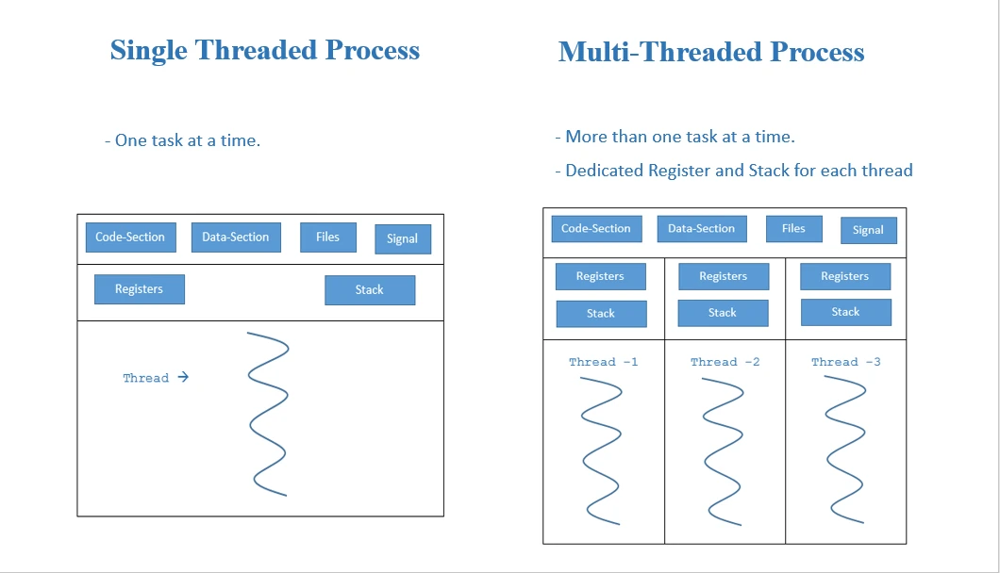

JavaScript is often described as a single-threaded language.

That description is useful, but incomplete.

In the browser, the JavaScript that drives your application typically runs on a main thread. That thread is responsible for executing JavaScript, responding to user input, and coordinating UI work.

So when you do something computationally expensive like

```js
const result = expensiveComputation(data);
```

the main thread gets occupied for a moment, visualized like so

```text
Main Thread
────────────────────────────────────────────
UI │ Input │ ██████████████████████████ │ UI
               expensive computation
```

The UI doesn't necessarily become completely frozen in every circumstance, but a long-running synchronous computation can prevent the browser from doing other work.

And that leads to an interesting question:

> **Can we move that expensive computation somewhere else?**

Yes, yes we can. Using Web Workers.

---

# Web Workers: JavaScript Outside the Main Thread

Browsers provide an API called **Web Workers**.

A Worker creates another JavaScript execution context that can execute independently from the main thread.

The simplest example looks like this:

```js
// script.js
const worker = new Worker("worker.js");

worker.postMessage({
    numbers: [1, 2, 3, 4]
});

worker.onmessage = event => {
    console.log(event.data);
};
```

The worker can then do:

```js
// worker.js
self.onmessage = event => {
    const result = expensiveComputation(event.data.numbers);
    self.postMessage(result);
};
```

Conceptually:

```text
              Browser
                 │
        ┌────────┴────────┐
        │                 │
        ▼                 ▼
   Main Thread          Worker
        │                 │
      UI work          computation
        │                 │
        └── postMessage ──┘
```

Now JavaScript is executing on more than one thread.

So in that sense:

> **Web Workers give JavaScript a form of multi-threaded execution.**

But they are not quite like conventional threads in languages such as C++ or Java.

---

# Workers Don't Share the JavaScript Heap

This is one of the most important things to understand about Web Workers.

A conventional thread typically shares the process's memory like

```text
Process
┌────────────────────────────────────┐
│ Shared Memory                      │
│                                    │
│ Thread 1     Thread 2     Thread 3 │
│    │            │            │     │
│    └────────────┼────────────┘     │
│                 │                  │
│            shared objects          │
└────────────────────────────────────┘
```

But Web Workers are different. Conceptually, you have:

```text
Browser
│
├── Main Thread
│     └── JavaScript Heap A
│
├── Worker 1 Thread
│     └── JavaScript Heap B
│
├── Worker 2 Thread
│     └── JavaScript Heap C
│
└── Worker 3 Thread
      └── JavaScript Heap D
```

A worker cannot access an object that belongs to the main thread.

Instead, the main thread and worker communicate through messaging:

```js
worker.postMessage(data);
```

and:

```js
self.postMessage(result);
```

This is somewhat analogous to [IPC](https://www.geeksforgeeks.org/operating-systems/inter-process-communication-ipc/) between processes:

```text
Main Thread
     │
     │ message
     ▼
┌───────────────┐
│    Browser    │
│ communication │
└───────────────┘
     │
     ▼
Worker
```

This isolation is intentional.

It makes existing JavaScript easier to reason about than a shared-memory JavaScript would be.

---

## Tedious Communication and Expanding Worker Capabilities

There is another problem you'll encounter with Web Workers that becomes apparent once you try to build something beyond a single isolated task

> **the Worker itself doesn't know what your application wants it to do.**

In a 2019 presentation by Surma titled ["The main thead is overworked & underpaid"](https://www.youtube.com/watch?v=7Rrv9qFMWNM&t=827), he pointed out a problem with progressively adding capabilities to a Worker: every new capability has to be explicitly implemented in the Worker, along with the communication protocol needed to invoke it from the main thread.

You might start with something simple:

```js
worker.postMessage({
    type: "parseCSV",
    data
});
```

Then the Worker needs to know about it:

```js
self.onmessage = event => {
    switch (event.data.type) {
        case "parseCSV":
            // ...
            break;
    }
};
```

Then you add another capability:

```js
case "resizeImage":
    // ...
    break;
```

Then another:

```js
case "compressData":
    // ...
    break;
```

And another.

Eventually, the Worker becomes a collection of hard-coded capabilities:

```text
                    Web Worker
                        │
              ┌─────────┼─────────┐
              │         │         │
           parseCSV  resizeImage  compress
              │         │         │
              └─────────┼─────────┘
                        │
                  message protocol
```

Every capability requires more than just implementing the function itself. You also need to define **how the main thread asks the Worker to execute it, how arguments are represented, how the result is returned, how errors are propagated, and how the response is associated with the original request.**

You eventually end up building your own little RPC system:

```text
Main Thread                         Worker
     │                                │
     │ { id: 1, type: "parseCSV" }    │
     ├───────────────────────────────►│
     │                                │
     │                                │ parseCSV()
     │                                │
     │ { id: 1, result: ... }         │
     │◄───────────────────────────────┤
     │                                │
```

And now you need bookkeeping:

```text
Request ID
Response mapping
Function/capability registry
Argument serialization
Result serialization
Promise resolution
Promise rejection
Error propagation
```

This is the part of Web Workers that can feel surprisingly tedious.

---

# The Idea Behind Worklet

The original idea was

> **"I want a simple API to off-load expensive computation from the main thread."**

Instead of:

```js
const worker = new Worker(...);
worker.postMessage(...);
worker.onmessage = ...;
```

I wanted something conceptually closer to:

```js
import { wrap } from "worklet";

const calculate = wrap(expensiveComputation);

const result = await calculate(data);
```

The rest came afterward.

Once that abstraction existed, several questions naturally appeared:

> What happens if I execute multiple tasks?

**A queue.**

> What happens if I have multiple tasks that could execute simultaneously?

**A pool of workers.**

> How many workers should I create?

**A worker limit based on available hardware.**

> What happens when a worker gets stuck?

**A timeout.**

> What happens when workers consume memory while doing nothing?

**An idle lifetime.**

> What happens when a worker crashes?

**Worker replacement.**

And Worklet gradually became something more interesting than simply:

```text
function → Web Worker
```

It became:

```text
function
   ↓
task
   ↓
scheduler
   ↓
worker pool
   ↓
result
```

The idea of a scheduler was not entirely new to me. About a year earlier, I had watched a presentation about [Go's scheduler](https://www.youtube.com/watch?v=YHRO5WQGh0k&t=1582s&pp=ygUMR28gc2NoZWR1bGVy) because I wanted to understand what was happening underneath Go's concurrency model—much in the same way that understanding JavaScript's event loop, event queue, microtask queue, and Web APIs can give you a better mental model of how JavaScript actually executes asynchronous work.

What stuck with me was the idea that concurrency doesn't necessarily mean manually managing the underlying execution resources yourself. You can have many units of work, while a scheduler decides when and where those units should execute.

That idea translated naturally to Worklet.

---

# From Function Wrapping to a Scheduler

The API can remain deceptively simple:

```js
const parseCSV = worklet.wrap(parseCSVFile);
```

But internally:

```text
parseCSV(file)
      │
      ▼
   Task ID
      │
      ▼
 Task Queue
      │
      ▼
  Scheduler
      │
      ├───────────────┐
      ▼               ▼
 Worker 1          Worker 2
      │               │
      ▼               ▼
   Task A           Task B
```

Suppose we have 25 CSV files:

```js
await Promise.all(
    files.map(file => parseCSV(file))
);
```

The application has created 25 tasks.

It doesn't necessarily create 25 Workers.

Instead, the scheduler might have:

```text
MAX_WORKERS = 16

25 tasks
│
├── Worker 1  → CSV 1
├── Worker 2  → CSV 2
├── Worker 3  → CSV 3
├── ...
├── Worker 16 → CSV 16
│
└── CSV 17-25 → queue
```

When Worker 4 finishes:

```text
Worker 4
   │
   └── finished CSV 4
             │
             ▼
         CSV 17
```

This is where the **worker pool** becomes important.

The developer thinks in terms of:

```text
Functions → Tasks
```

rather than:

```text
Functions → Workers
```

The workers become an implementation detail.

---

# This Starts to Look a Little Like Go

At this point, the architecture starts to resemble something familiar from languages such as Go.

Go gives developers:

```go
go expensiveComputation()
```

and the Go runtime takes responsibility for scheduling goroutines across available threads.

Worklet provides something conceptually similar:

```js
const compute = worklet.wrap(expensiveComputation);

compute(data1);
compute(data2);
compute(data3);
```

and the Worklet scheduler distributes those tasks across Workers.

Conceptually:

```text
             Application
                  │
             many tasks
                  │
                  ▼
              Scheduler
                  │
        ┌─────────┼─────────┐
        ▼         ▼         ▼
       W1        W2        W3
```

But this is **not the same concurrency model as Go**.

A goroutine is an extremely lightweight language/runtime abstraction over execution contexts managed by the Go runtime.

A Web Worker is much heavier:

```text
Go:

goroutine
   ↓
Go runtime scheduler
   ↓
OS threads


JavaScript:

task
   ↓
Worklet scheduler
   ↓
Web Worker
   ↓
browser / OS thread
```

And Workers have isolated JavaScript heaps.

So the analogy is:

> **Worklet has a Go-like feeling at the scheduling/API level, but not Go's underlying execution model.**

---

# Looking for Others just like Worklet

While exploring the Web Worker ecosystem, I came across [`useWorker`](https://www.youtube.com/watch?v=jB0-KQrQ7HY).

It immediately looked familiar.

`useWorker` provides an abstraction where a function can be executed in a Web Worker rather than directly on the main thread.

Conceptually:

```js
const [workerFunction] = useWorker(expensiveFunction);

const result = await workerFunction(data);
```

This overlaps significantly with Worklet:

Both are trying to provide the same fundamental developer experience:

```text
ordinary function
       ↓
worker-backed function
       ↓
Promise
```

That was useful because it demonstrated that the basic idea of **"wrap a function and execute it in a Web Worker"** is independently useful.

But there is an important architectural difference.

## useWorker vs Worklet

[`useWorker`](https://github.com/alewin/useWorker) and Worklet share a similar goal: **take a JavaScript function and execute it away from the main thread**.

The difference is primarily in **what owns and manages the Worker, and how concurrent work is scheduled**.

`useWorker` is primarily a **React-oriented abstraction around an individual Web Worker**:

```text
React
  │
  ▼
useWorker()
  │
  ▼
Web Worker
```

Worklet is designed as a **framework-independent execution system**:

```text
Core ─────┐
React ────┤
Vue ──────┤
Svelte ───┤
Vanilla ──┘
     │
     ▼
  Worklet
     │
 Scheduler
     │
 Worker Pool
```

### One `useWorker` instance, one Worker

With `useWorker`, a wrapped function is associated with a Worker instance.

For example:

```js
const [parse_csv] = useWorker(parse_csv_func);
const [fibonacci] = useWorker(fibonacci_func);
```

These are two independent `useWorker` instances, and therefore two independent Workers:

```text
parse_csv()
     │
     ▼
┌─────────────────────┐
│      Worker 1       │
│                     │
│     parse_csv()     │
└─────────────────────┘


fibonacci()
     │
     ▼
┌─────────────────────┐
│      Worker 2       │
│                     │
│    fibonacci()      │
└─────────────────────┘
```

There is an important detail, however: [**a single `useWorker` instance only allows one invocation to be running at a time.**](https://github.com/alewin/useWorker/blob/master/packages/useWorker/src/useWorker.ts#L162) It does not maintain a task queue for concurrent calls.

For example:

```js
const [parse_csv] = useWorker(parse_csv_func);

await Promise.all([
    parse_csv(file1),
    parse_csv(file2),
    parse_csv(file3),
    parse_csv(file4),
]);
```

The first call starts the Worker:

```text
parse_csv(file1)
       │
       ▼
   Worker 1
       │
    running
```

While that Worker is running, another invocation of the same `useWorker` instance is rejected rather than queued.

Conceptually:

```text
Worker 1
────────────────────────────────────────────
████████ file1 ████████████
        │
        ├── parse(file2) → rejected
        ├── parse(file3) → rejected
        └── parse(file4) → rejected
```

To execute multiple invocations of the same function concurrently with `useWorker`, you need multiple `useWorker` instances:

```js
const [parse_csv_1] = useWorker(parse_csv_func);
const [parse_csv_2] = useWorker(parse_csv_func);
const [parse_csv_3] = useWorker(parse_csv_func);
const [parse_csv_4] = useWorker(parse_csv_func);
```

which gives you:

```text
parse_csv_1 ──► Worker 1
parse_csv_2 ──► Worker 2
parse_csv_3 ──► Worker 3
parse_csv_4 ──► Worker 4
```

This means concurrency is exposed at the **Worker instance level**.

### Worker lifetime

`useWorker` also has an `autoTerminate` option.

By default:

```js
autoTerminate: true
```

When the task finishes, the Worker is terminated:

```text
call
 │
 ▼
create Worker
 │
 ▼
execute function
 │
 ▼
resolve Promise
 │
 ▼
terminate Worker
```

The next invocation creates another Worker.

With:

```js
const [parse_csv] = useWorker(parse_csv_func, {
    autoTerminate: false,
});
```

the Worker remains alive and can be reused:

```text
call #1
   │
   ▼
Worker 1
   │
   ▼
result
   │
   │  Worker remains alive
   ▼
call #2
   │
   ▼
Worker 1
```

However, this still does not turn the Worker into a concurrent task queue. Only one invocation can be active at a time for that `useWorker` instance.

---

## Worklet: Functions Become Tasks

Worklet takes a different approach.

Instead of associating a Worker with a function, Worklet treats each invocation as a **task**.

```js
import { wrap } from "worklet";

const parse_csv = wrap(parse_csv_func);
const fibonacci = wrap(fibonacci_func);
```

Calling the wrapped function creates work that is submitted to the scheduler:

```js
await Promise.all([
    parse_csv(file1),
    parse_csv(file2),
    parse_csv(file3),
    parse_csv(file4),
    fibonacci(32),
]);
```

The scheduler can distribute those tasks across the available Workers:

```text
                         Worklet
                            │
                         Scheduler
                            │
          ┌─────────────────┼─────────────────┐
          ▼                 ▼                 ▼
       Worker 1          Worker 2          Worker 3
          │                 │                 │
     parse_csv(file1)  parse_csv(file2)  parse_csv(file3)
```

If the pool is limited to four Workers:

```text
Task 1 ──► Worker 1
Task 2 ──► Worker 2
Task 3 ──► Worker 3
Task 4 ──► Worker 4
Task 5 ──► Queue
Task 6 ──► Queue
```

When a Worker becomes available:

```text
Task 2
   │
   └── finished
          │
          ▼
       Worker 2
          │
          ▼
       Task 5
```

The Worker is therefore an **execution resource**, rather than something permanently associated with a particular function.

You can have many different functions:

```js
const parse_csv = wrap(parse_csv_func);
const resize_image = wrap(resize_image_func);
const compress = wrap(compress_func);
const calculate = wrap(calculate_func);
```

while still maintaining a fixed Worker limit:

```text
                    Scheduler
                        │
             ┌──────────┼──────────┐
             ▼          ▼          ▼
            W1         W2         W3
             │          │          │
          parse       resize     calculate
             │          │          │
             └──────────┴──────────┘
                        │
                  Workers become
                     available
                        │
                        ▼
                  next queued task
```

The scheduler determines **which Worker executes which task**.

---

## The Key Architectural Difference

The distinction can be summarized as:

```text
useWorker

Wrapped Function
       │
       ▼
    Worker
       │
       ▼
   One task at a time
```

versus:

```text
Worklet

Wrapped Function
       │
       ▼
      Task
       │
       ▼
   Scheduler
       │
       ▼
   Worker Pool
       │
   ┌───┼───┐
   ▼   ▼   ▼
  W1  W2  W3
```

This means Worklet separates **what is being executed** from **where it is executed**.

With `useWorker`, the relationship is roughly:

```text
Function instance ──► Worker instance
```

With Worklet:

```text
Function invocation ──► Task ──► Scheduler ──► Worker
```

That distinction is central to Worklet.

> **`useWorker` abstracts the Worker; Worklet abstracts the execution of tasks across Workers.**

The goal of Worklet is therefore not simply to make `new Worker()` easier to use. It is to move **task scheduling, concurrency, Worker reuse, Worker limits, and Worker lifecycle** out of application code and into the execution abstraction.

---

# Putting Worklet to the Test

At this point, it is easy to talk about worker pools in terms of architecture:

> "Tasks are distributed across multiple Workers."

But what does that actually mean in practice?

To test this, I built a small CSV parsing benchmark using the same dataset in both configurations:

* **7 CSV files**
* The files range from approximately **5 MB to 86 MB**
* The largest file contains **500,000 rows**
* All files are parsed into JavaScript arrays
* The same parser and dataset are used in both tests
* The only significant difference is **where the parsing work executes**

The files used for the benchmark were:

| File                   |    Size |
| ---------------------- | ------: |
| `customers-500000.csv` | 86.5 MB |
| `customers-100000.csv` | 17.3 MB |
| `sample-10mb.csv`      | 10.5 MB |
| `sample-20mb.csv`      | 21.0 MB |
| `sample-5mb.csv`       |  5.2 MB |
| `sample-15mb.csv`      | 15.7 MB |
| `sample-30mb.csv`      | 31.5 MB |

The total input is roughly **186 MB of CSV data**.

The important part is that this is not a tiny synthetic benchmark. The parser has to process hundreds of megabytes of text and construct hundreds of thousands of JavaScript values.

---

## Main Thread vs Worklet

The first test performs all parsing directly on the main thread:

```js
const results = await Promise.all(
    files.map(file => parse_csv(file))
);
```

The second test uses Worklet:

```js
const worker_parse_csv = wrap(parse_csv);

const results = await Promise.all(
    files.map(file => worker_parse_csv(file))
);
```

The application itself doesn't need to know that the second version is using multiple Workers.

The difference is what happens underneath.

### Main Thread

```text
                    Main Thread
──────────────────────────────────────────────

CSV #1 ███████████████████
                         CSV #2 ███████████████
                                              CSV #3 ███████
                                                       ...

                         UI
                         │
                         ├── rendering
                         ├── events
                         ├── microtasks
                         └── parsing
                              ↑
                         competing for
                         the same thread
```

Every parsing operation is competing with the browser's main-thread work.

The JavaScript engine can only execute one piece of JavaScript at a time on that thread.

So while the parser is doing something expensive:

```js
for (...) {
    // parse CSV
}
```

the browser cannot simultaneously execute another piece of JavaScript on that same thread.

---

## With Worklet

With Worklet, the same calls become tasks:

```text
                         Worklet
                            │
                         Scheduler
                            │
          ┌─────────────────┼─────────────────┐
          ▼                 ▼                 ▼
      Worker #1         Worker #2         Worker #3
          │                 │                 │
       CSV #1            CSV #2            CSV #3
          │                 │                 │
          ▼                 ▼                 ▼
       result            result            result
```

Instead of:

```text
Main Thread
──────────────────────────────────────────────
██████████████████████████████████████████████
CSV #1 → CSV #2 → CSV #3 → CSV #4 → ...
```

the workload can become:

```text
Worker #1  █████████████ CSV #1 █████████████
Worker #2  ███████ CSV #2 █████████
Worker #3  ███████████████ CSV #3 ███████████
Worker #4  █████ CSV #4 ███████
```

These are independent JavaScript execution contexts.

The browser can schedule those Workers across available CPU resources while the main thread remains available for the application.

This is where the distinction between **concurrency** and **parallelism** becomes important.

`Promise.all()` by itself does not make JavaScript CPU work parallel.

It gives us concurrency at the asynchronous programming level.

Worklet adds the missing execution resources:

> **The scheduler turns concurrent tasks into work that can actually execute in parallel across multiple Workers.**

---

# The Results

For this particular benchmark, the results were:

| Metric                             | Main Thread |                      Worklet |
| ---------------------------------- | ----------: | ---------------------------: |
| Parsing time                       |  **4.42 s** |                   **3.10 s** |
| Total JS heap observed             | **~1.3 GB** |                  **~1.8 GB** |
| Main-thread CPU pressure           |        High |                   Much lower |
| Parallel execution                 |          No |                          Yes |
| UI thread available during parsing |     Limited | Significantly more available |

The Worklet version completed the workload in approximately:

**3.10 seconds**

compared with:

**4.42 seconds**

on the main thread.

That's roughly a **30% reduction in elapsed parsing time** in this particular test.

> [!NOTE]
> The System hardware and software used for this test are
> OS: Linux Mint 22.2 Cinnamon
> Browser: Chromium Version 150.0.7871.186 (Official Build) for Linux Mint (64-bit)
> CPU: Ryzen 7 8745HS 
> Memory: 24GB LPDDR5X

```text
Main Thread

4.42 seconds
████████████████████████████████████████████


Worklet

3.10 seconds
████████████████████████████
```

This is not a claim that every workload will become 30% faster.

The actual improvement depends on:

* CPU core count
* Worker startup overhead
* serialization/deserialization
* task size
* memory bandwidth
* garbage collection
* how much of the workload is actually CPU-bound
* how much work can execute independently

But the important thing is that **the workload has become parallelizable**.

---

# The More Interesting Result: UI Responsiveness

The execution time is only half of the story.

For a browser application, this can actually be more important:

> **What happens to the UI while the computation is running?**

When parsing occurs on the main thread, the parser competes directly with:

```text
Main Thread
│
├── JavaScript
├── Event handlers
├── Microtasks
├── DOM work
├── Rendering
├── Layout
├── Painting
└── CSV parsing
```

A sufficiently large CSV can therefore produce long periods where the browser has little opportunity to respond to user interaction.

In the benchmark, the Chrome Performance trace shows substantial main-thread activity during the main-thread parsing test.

With Worklet, that CPU-heavy parsing work moves away from the main thread:

```text
Main Thread
────────────────────────────────────────────
UI     Events     Rendering     UI     Events
████     ██          ███         ███      ██


Worker #1
────────────────────────────────────────────
████████████████████████████████████████████
             CSV parsing


Worker #2
────────────────────────────────────────────
████████████████████████████████████████████
             CSV parsing


Worker #3
────────────────────────────────────────────
████████████████████████████████████████████
             CSV parsing
```

The main thread still has work to do.

Messages must still be received, results must still be processed, and the browser still has to perform rendering.

But the **expensive parsing loop itself is no longer occupying the UI thread**.

That distinction is important.

> Worklet isn't merely about making a computation finish sooner.
> It is about moving computation away from the thread responsible for keeping the application responsive.

---

# The Cost: Memory

There is, however, no free lunch.

The Worklet benchmark used approximately:

**~1.8 GB of JavaScript heap**

while the main-thread version used approximately:

**~1.3 GB.**

At first glance, this might look like a disadvantage of Worklet:

```text
Main Thread       ~1.3 GB
Worklet           ~1.8 GB
                  ↑
               +500 MB
```

And it is a real cost.

But the reason is important.

Web Workers do **not** share the normal JavaScript heap with the main thread.

Conceptually:

```text
             Main Thread
             ┌──────────┐
             │ JS Heap  │
             │ ~1.3 GB  │
             └──────────┘

                  ↕
             structured
               cloning /
             transferring

      ┌──────────┬──────────┬──────────┐
      ▼          ▼          ▼          ▼
 Worker #1   Worker #2   Worker #3   Worker #4
 ┌───────┐   ┌───────┐   ┌───────┐   ┌───────┐
 │ Heap  │   │ Heap  │   │ Heap  │   │ Heap  │
 └───────┘   └───────┘   └───────┘   └───────┘
```

Each Worker has its own JavaScript execution context and heap.

When a large computation produces:

```js
[
    [/* 500,000 rows */],
    [/* 100,000 rows */],
    ...
]
```

those objects aren't magically shared between the Worker and the main thread.

They have to cross the Worker boundary.

For ordinary JavaScript objects, this generally means the **structured clone algorithm** creates another representation in the receiving context.

That can result in significant memory consumption for large datasets.

---

# Parallelism Has a Price

This gives us one of the fundamental trade-offs of Worklet:

```text
                 Worklet
                    │
          ┌─────────┴─────────┐
          │                   │
       Benefits             Costs
          │                   │
          ▼                   ▼
    Parallelism           More memory
    Concurrency           Serialization
    UI responsiveness     Deserialization
    CPU utilization       Worker startup
    Task isolation        Scheduling overhead
```

The 1.8 GB result is therefore not something to hide.

It is one of the most important observations from the experiment.

> **Worklet trades memory and communication overhead for parallel execution and a more responsive main thread.**

And that trade-off is highly workload-dependent.

For a tiny function:

```js
const add = (a, b) => a + b;
```

sending the work to another Worker would be absurdly expensive relative to the computation itself.

You would be paying for:

```text
postMessage
    ↓
serialization
    ↓
thread scheduling
    ↓
function execution
    ↓
serialization
    ↓
postMessage
```

to perform:

```js
a + b
```

But for something like:

```text
86 MB CSV
     ↓
500,000 rows
     ↓
parsing
     ↓
validation
     ↓
transformation
     ↓
large result
```

the computation can be large enough to justify the overhead.

This is the type of workload Worklet is designed to target.

---

# The Real Benefit of Worklet

The benchmark therefore demonstrates something slightly different from simply:

> "Workers are faster."

That isn't universally true.

The more interesting statement is:

> **Worklet gives ordinary JavaScript functions access to a pool of independent execution contexts, allowing expensive CPU-bound tasks to execute concurrently and, where the hardware permits, in parallel without occupying the main thread.**

The architecture changes the shape of the problem:

```text
Before

             Main Thread
                  │
                  ▼
        ┌─────────────────┐
        │    CSV Parser   │
        └─────────────────┘
                  │
                  ▼
             UI blocked
```

becomes:

```text
After

                  Worklet
                     │
                  Scheduler
                     │
       ┌─────────────┼─────────────┐
       ▼             ▼             ▼
   Worker #1     Worker #2     Worker #3
       │             │             │
    CSV #1         CSV #2         CSV #3
       │             │             │
       └─────────────┼─────────────┘
                     ▼
                  Results
                     │
                     ▼
                Main Thread
                     │
                     ▼
                    UI
```

And this is ultimately what Worklet is trying to provide:

> **Not faster JavaScript by itself, but another execution model for JavaScript.**

The main thread remains the place where the application lives.

Worklet provides a way to move expensive, independent computation somewhere else—and lets a scheduler decide **which Worker should perform it, when it should run, and when that Worker should go away.**

---

# So Is JavaScript Still Single-Threaded?

A JavaScript execution context executes code sequentially but the browser can host multiple JavaScript execution contexts like

```text
Main Thread
Worker 1
Worker 2
Worker 3
Worker 4
...
```

Those contexts can execute simultaneously. They just simply don't share arbitrary JavaScript objects.

Web Workers are one of those mechanisms and Worklet builds an abstraction on top of them:

- It doesn't turn JavaScript into Go.
- It doesn't turn Workers into shared-memory threads.
- And it doesn't eliminate the cost of moving data.

What it does is make a capability that is otherwise fairly low-level feel like something much closer to

Multi-threading in JavaScript... Sort of.
