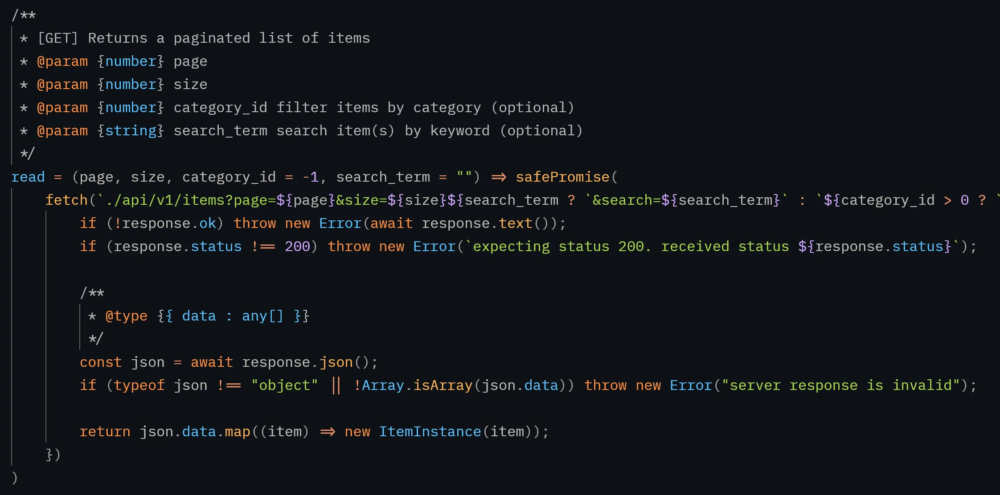
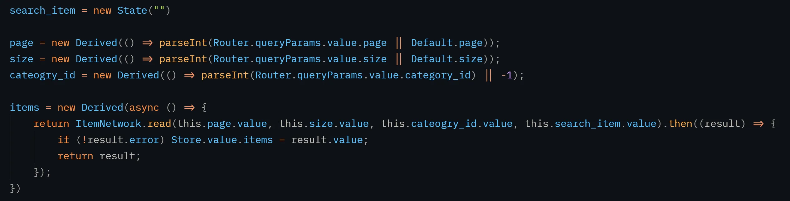
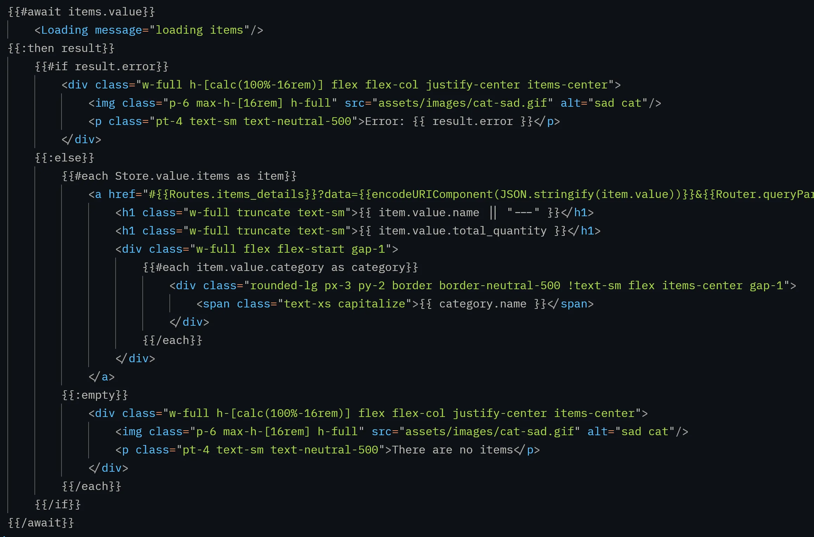

# Safe Value?

One of the things that made my life easier as a web developer was creating a port of `err != nil` and `return nil, err` from Go to JS and `Safe Value` is my implementation of that error handling paradigm in JS

Take the picture below for example. It's a function that calls fetch and returns an `ItemInstance[]` the item instance uses [ValidType](/blog/validtype-more-stuff-i-built) a validation library that throws an error if the schema does not match and it is wrapped in a `safePromise` that returns a `Promise<SafeValue<ItemInstance[]>>`. if any error is throw within that promise, it will return a `{ value : null, error : "some kind of error" }`. Easy!

Combined that with declarative code (picture below) and you got yourself a network call that is re-executed when either the `page`, `page size`, `category`, `search word` changes

In the template we use `{{#await}}` to wait for the network call to finish and when it finishes, we use `{{$if}}` to display an error UI if there is an error, or continue using `{{#each}}` to render each item.

By using `ValidType` in combination with `SafeValue` I'm making sure that the data the server responds with is the data that I'm expecting and with declarative code using `Signals` it makes rendering UIs a lot simpler and easier

<video controls>
  <source src="./assets/demo.webm" type="video/webm">
</video>
