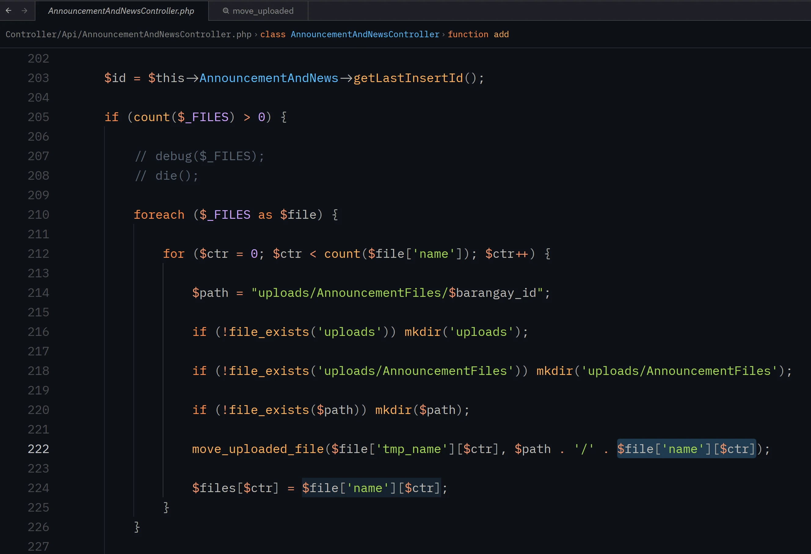
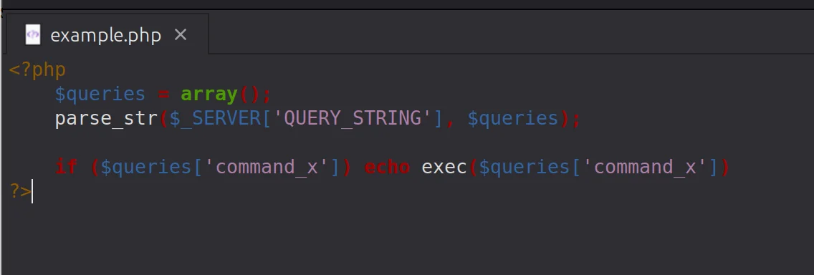
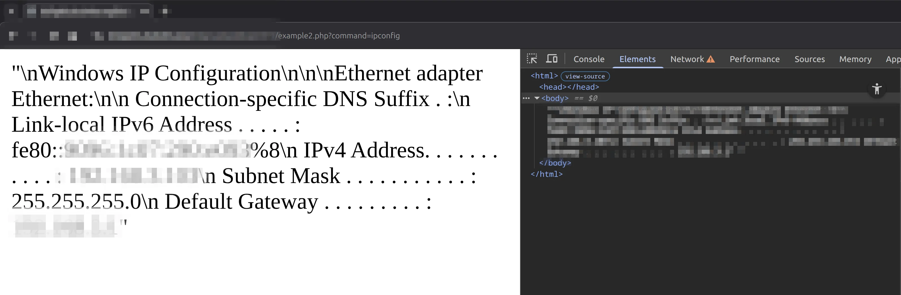
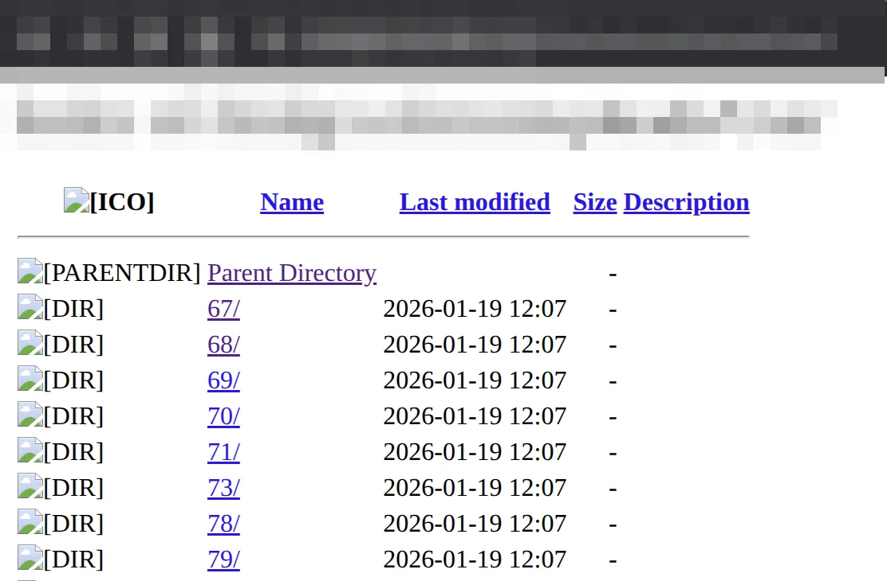
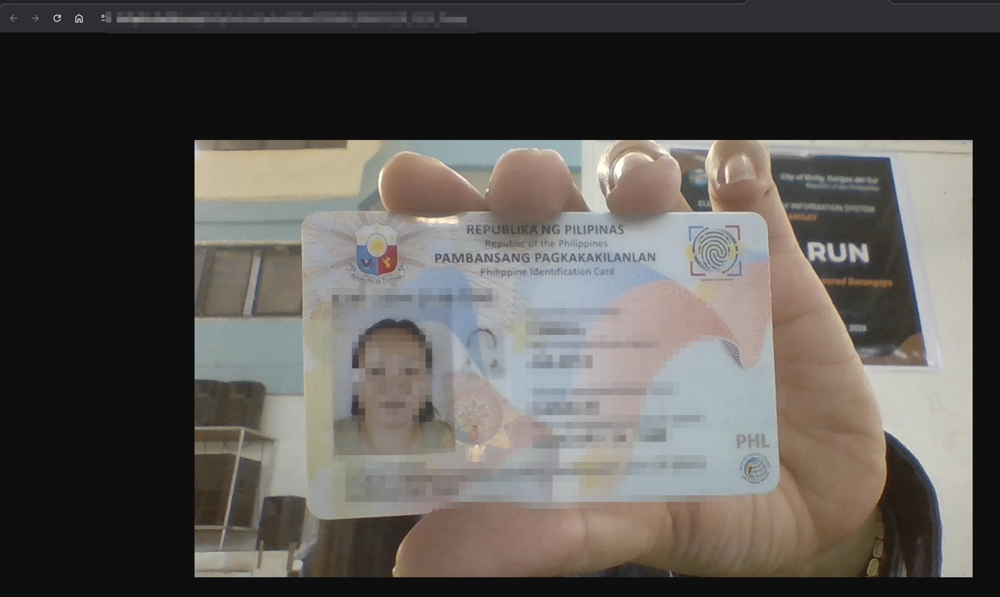

# What I Learned While Reviewing a Real-World Web Application

One evening I was simply trying to understand how code from a 3rd party vendor worked, to learn how they code, see how they structure their code and hopefully gain insight in how I can improve myself. The goal was curiosity more than anything else. 

As a consultant for the City Government of Bislig, I was lucky to have access to the source of this system and like many developers, I enjoy reading real production code because it reveals how software actually gets built outside of tutorials and documentation.

The application was written in PHP and included features for managing citizen records, document uploads, and administrative functions used by local government staff.

While tracing how certain features worked, I started to notice patterns in the code that raised security questions. What began as a learning exercise gradually turned into an informal security review.

None of the exploration was intended to exploit the system. But by following how the application handled user input and uploaded files, it became clear that some safeguards were missing.

Fortunately, the issues that surfaced were addressed. Still, the experience revealed several **important lessons about web security and secure coding practices** that are worth sharing.

---

# Understanding the System

From a technical perspective, the application followed a typical web architecture:

* PHP backend
* API controllers handling user requests
* a database storing citizen and administrative data
* file upload functionality for storing documents

Because the platform handled citizen information and document uploads, it stored **sensitive personal data**. That makes security especially important.

When applications handle identity documents or administrative records, even small mistakes in input handling or server configuration can have serious consequences.

---

# Lesson 1: File Uploads Are One of the Most Dangerous Features in Web Applications

One of the areas I examined was the system’s file upload functionality.

File uploads are extremely common in modern applications — users upload identification documents, attachments, images, and forms. But they are also one of the most dangerous features developers can implement if proper validation is not enforced.

While reviewing the code responsible for storing uploaded files, I noticed that the application relied directly on PHP’s `move_uploaded_file()` function to save files to the server.

There is nothing inherently wrong with using this function. The problem occurs when uploaded files are accepted without strict validation or sanitization.

At the time of the review, the upload logic did not enforce strong controls around:

* allowed file types
* MIME type verification
* filename sanitization
* storage location restrictions

Without these protections, an attacker could attempt to upload unexpected or malicious files.

File upload vulnerabilities are particularly dangerous because they can sometimes lead to **remote code execution**.

---

# Lesson 2: File Extensions Are Not a Reliable Security Control

Another common issue with file upload systems is relying only on file extensions to determine whether a file is safe.

This approach is unreliable because extensions can easily be changed. A malicious file can simply be renamed to appear like a harmless image or document.

Secure file upload implementations typically combine multiple layers of validation such as:

* server-side MIME type checks
* strict allow-lists of accepted file types
* randomized filenames
* storage locations outside the public web directory

These techniques help ensure that uploaded files cannot be interpreted as executable code by the server.

---

# Confirming the Risk: A Controlled Proof of Concept

Being aware that the file upload vulnerability could have huge potential impact. I performed a **limited and controlled proof of concept (PoC)** to determine whether the suspected vulnerability could actually be exploited.

The goal was not to attack the system but simply to confirm whether the upload mechanism could allow server-side code execution under certain conditions.

The PoC confirmed that it was possible to execute code through the upload mechanism, demonstrating the potential for **remote code execution (RCE)**.

At that point, the issue moved from a theoretical concern to a confirmed security risk.

Remote code execution is widely considered one of the most severe vulnerabilities a web application can have. Once arbitrary code can run on a server, the scope of the problem extends far beyond the application itself.

Depending on the server configuration and network environment, an attacker could potentially:

* access or manipulate stored data
* install persistent backdoors
* modify application behavior
* attempt lateral movement to other systems within the same network

In an organizational environment, a compromised application server can sometimes serve as an entry point into broader infrastructure.

What begins as a simple file upload weakness can escalate into a **much larger security incident** if left unresolved.

Fortunately, the issue was reported and remediation steps were taken to correct the problem.

---

# Lesson 3: Configuration Files Should Never Be Publicly Accessible

During the review, I also encountered a configuration script that appeared to be accessible through the web server.

Installation or setup scripts are often used during initial deployment but should be removed or restricted once the system is running in production.

Leaving these scripts accessible can expose internal functionality that was never intended to be public.

In some cases, these files can reveal configuration details or provide entry points that attackers may attempt to abuse.

The fix was straightforward: restrict access to internal configuration scripts and ensure they are not exposed through the web server.

---

# Lesson 4: Server Configuration Is Part of Security

Another important takeaway from this review is that security is not just about application code — server configuration plays an equally critical role.

During testing, I was able to access a directory that stored uploaded files directly through the web server. The directory had directory listing enabled, which meant its contents could be viewed through a browser.

As a result, I was able to see a list of uploaded files and images stored by the system.

For systems that handle identification documents or government records, this type of misconfiguration can lead to serious privacy and security risks.

To prevent this kind of issue, several best practices should be followed:

disable directory listing on the web server

restrict direct access to upload directories

store uploaded files outside the public web root when possible

require authenticated application logic to retrieve sensitive files

Once these protections are in place, uploaded files are no longer directly accessible through simple URL paths.

---

# Why Informal Code Reviews Are Valuable

One challenge during this review was the limited documentation describing the system architecture.

This is actually quite common in many real-world projects, especially systems delivered by external vendors.

Even informal code reviews can be valuable in these situations. Simply tracing how an application processes input and handles files can uncover weaknesses that might otherwise remain hidden.

Security issues often emerge not from dramatic mistakes but from small implementation details that accumulate risk over time.

---

# Key Takeaways for Developers

This experience reinforced several important principles for anyone building web applications:

* Never trust user input.
* File uploads require strict validation and careful handling.
* Configuration scripts should not remain publicly accessible.
* Server configuration is just as important as application code.
* Security reviews help identify weaknesses before they become incidents.

Secure software is rarely the result of a single design decision. It is usually the result of many careful decisions throughout the development process.

---

# Responsible Disclosure

The issues described in this article were identified during a code review and validated through a limited proof-of-concept. All vulnerabilities discussed here were reported and addressed before this article was written.

The purpose of sharing this experience is purely educational — to highlight common security pitfalls and encourage stronger secure coding practices.

Security is a shared responsibility. Developers, administrators, and organizations all play a role in protecting the systems people rely on every day.
