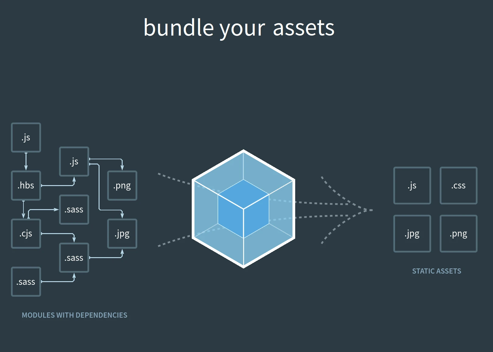

When people discuss runtime compilation, the conversation almost always centers around performance.

Questions usually sound like:

* Isn't runtime compilation slower?
* Why compile in the browser?
* Wouldn't it be better to compile ahead of time?
* Why not just use a build tool?

These are reasonable questions, but they often overlook a more interesting consequence of runtime compilation.

The real opportunity is not that components can be compiled in the browser.

The real opportunity is that **components remain components after deployment.**

---

## The Build-Time Assumption

Most modern frontend frameworks follow a similar workflow:

```text
Source Files
    ↓
Build Tool
    ↓
JavaScript Bundle
    ↓
Browser
```

A component may begin its life as:

```text
App.vue
UserCard.svelte
Dashboard.tsx
```

but after the build process, those files no longer exist in a meaningful runtime form.

The browser receives JavaScript.

The framework receives JavaScript.

The component becomes an implementation detail of the build system.

This approach has many benefits:

* Faster startup performance
* Static optimizations
* Smaller runtime overhead
* Dead code elimination
* Asset bundling

But there is also a tradeoff.

Once the application is built, components are no longer runtime resources.

---

## Components Disappear

Imagine deploying an application built with a traditional build pipeline.

Before deployment:

```text
App.vue
Settings.vue
Profile.vue
```

After deployment:

```text
assets/index-7f8a92.js
```

The original components have effectively disappeared.

The browser cannot request them.

The application cannot discover them.

The server cannot easily distribute them.

They have been transformed into implementation details of a bundle.

For most applications, this is perfectly acceptable.

But it closes the door on a different class of possibilities.

---

## Runtime Compilation Preserves Components

Runtime compilation takes a different approach.

Instead of compiling components before deployment, components remain available as runtime resources.

```text
App.html
Settings.html
Profile.html
```

The browser can request them directly.

The runtime can process them directly.

The server can distribute them directly.

Most importantly:

> Components remain components after deployment.

This sounds simple, but it fundamentally changes what becomes possible.

---

## Components Become Deployable Units

In a runtime compilation model, a component is no longer merely source code.

A component becomes a deployable resource.

```text
UserProfile.html
```

can be:

* Hosted on a server
* Requested on demand
* Updated independently
* Distributed separately
* Cached independently

The component becomes the unit of deployment.

Not the bundle.

Not the application.

The component.

---

## Dynamic Distribution

Consider a traditional application.

Adding a new feature often means:

```text
Modify Source
    ↓
Build Application
    ↓
Deploy Application
```

Even if only a single component changed.

With runtime-distributed components:

```text
Deploy New Component
    ↓
Application Loads Component
```

No application rebuild is required.

The application can discover and execute new functionality dynamically.

---

## Plugin Architectures Become Simpler

Plugin systems are notoriously difficult to build.

Most frontend plugin architectures eventually run into the reality that components have already been bundled into the application.

Runtime components change that equation.

A plugin can simply become:

```text
Plugin Component URL
```

The application downloads the component and executes it.

```text
Plugin
    ↓
Component
    ↓
Runtime
```

No recompilation.

No rebuild.

No bundling process.

---

## User-Generated Interfaces

Because components remain deployable resources, applications can support scenarios that are difficult in build-centric systems.

For example:

```text
User Creates Component
        ↓
Upload Component
        ↓
Application Executes Component
```

The application can consume new UI definitions without requiring a deployment pipeline.

Whether this is desirable depends on the application, but the capability exists because components remain available at runtime.

---

## Server-Generated Components

A server can generate components dynamically.

```text
Request
    ↓
Generate Component
    ↓
Return Component
    ↓
Execute Component
```

Instead of generating HTML, the server can generate reusable interactive components.

The browser receives a component rather than the final rendered output.

---

## Component Marketplaces

Runtime resources also enable a different way of thinking about distribution.

Imagine:

```text
Download Component
        ↓
Load Component
        ↓
Use Component
```

without rebuilding the application.

Because components remain deployable units, applications can consume functionality in the same way they consume other web resources.

---

## Runtime Compilation Is Not The Goal

It is important to understand that runtime compilation itself is not the objective.

The objective is not:

> Compile things in the browser.

The objective is:

> Keep components available as runtime resources.

Runtime compilation simply happens to be the mechanism that makes this possible.

The interesting outcome is not the compiler.

The interesting outcome is what remains available after deployment.

---

## Progressive Optimization

A common criticism of runtime systems is that compilation work must occur in the browser.

Historically, this has been one of the strongest arguments for build tools.

However, runtime compilation and progressive optimization are not mutually exclusive.

Systems such as JavaScript engines and JVMs have demonstrated this for decades.

Code can remain a runtime resource while still becoming faster over time.

This idea inspired the development of Core Assist.

Instead of treating compilation as work that must occur repeatedly, compilation becomes:

```text
Component
    ↓
Compile Once
    ↓
Store Result
    ↓
Reuse Result
```

The component remains a runtime resource.

The browser progressively eliminates repeated compilation work.

---

## A Different Way To Think About Frontend Applications

The traditional frontend mindset is:

> Build, bundle, and ship.

Runtime-distributed components suggest a different perspective:

> Distribute, execute, and progressively optimize.

In this model:

* Components remain deployable units
* Components remain discoverable
* Components remain executable resources
* Performance improves through reuse and caching

The browser becomes more than a destination for compiled code.

It becomes both the runtime and the optimization layer.

---

## Closing Thoughts

The surprising opportunity offered by runtime compilation is not that code can be compiled in the browser.

The surprising opportunity is that components never stop being components.

They remain deployable resources that can be loaded, distributed, cached, shared, updated, and executed long after an application has been deployed.

Whether this model is appropriate for every application is a separate discussion.

But it opens architectural possibilities that largely disappear once components are transformed into a bundle.

And that may be the most interesting aspect of runtime compilation.
